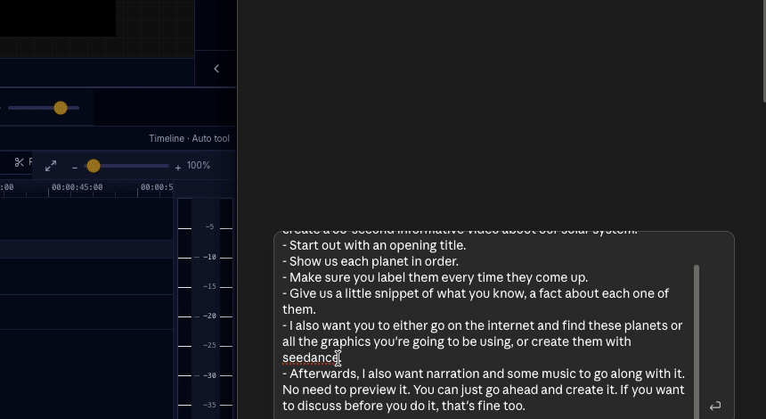
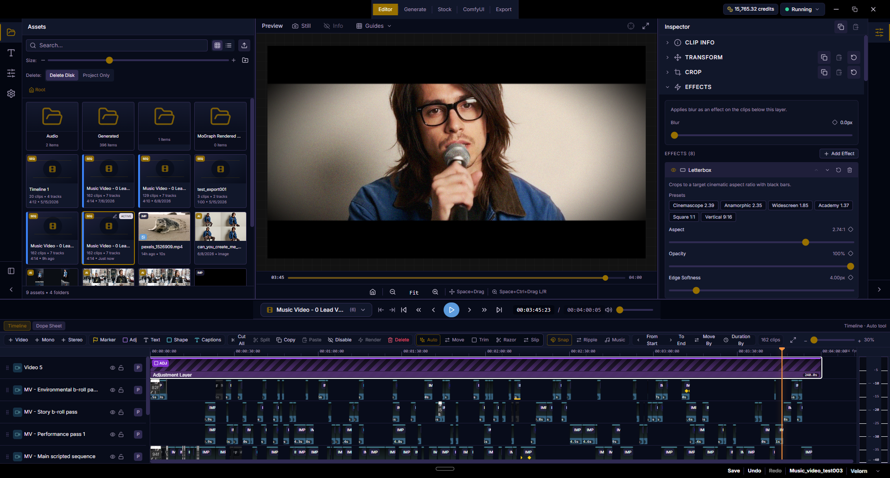
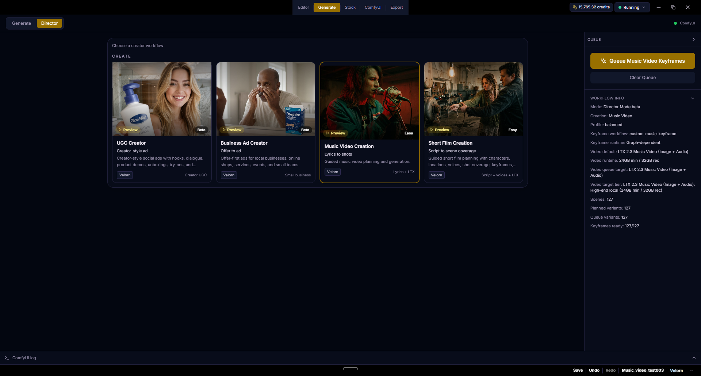
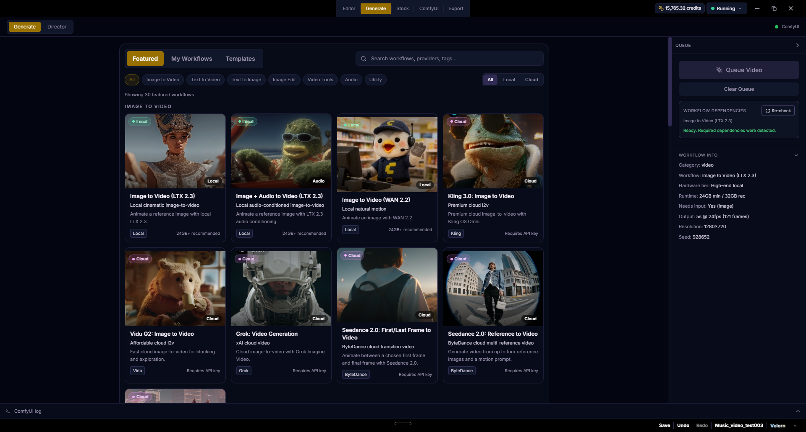
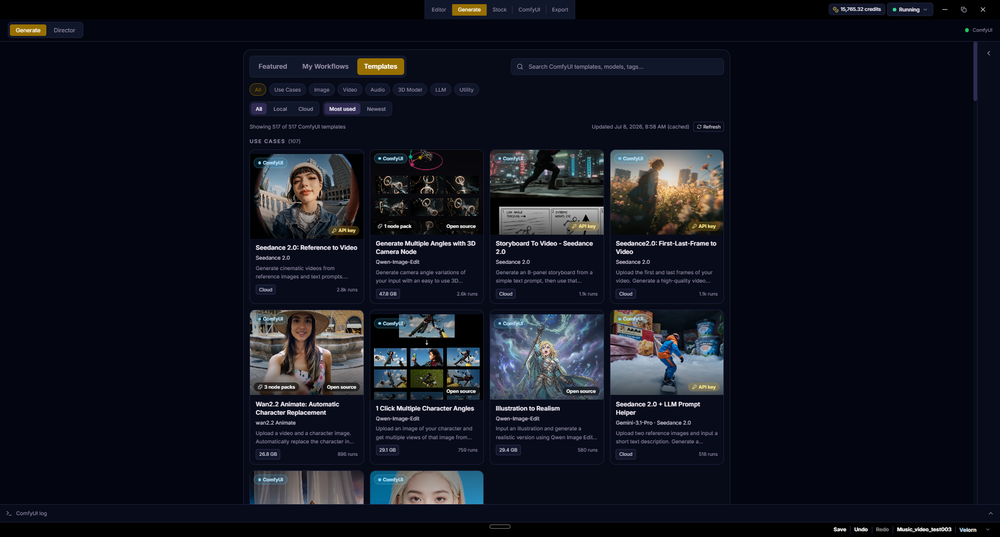
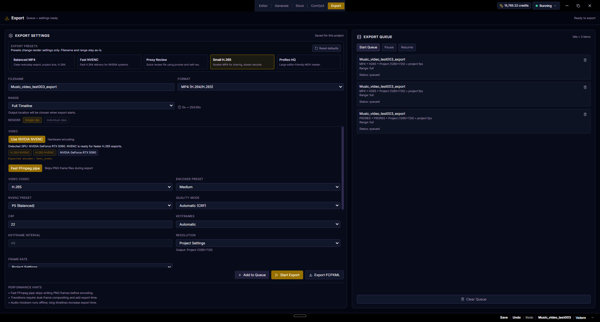
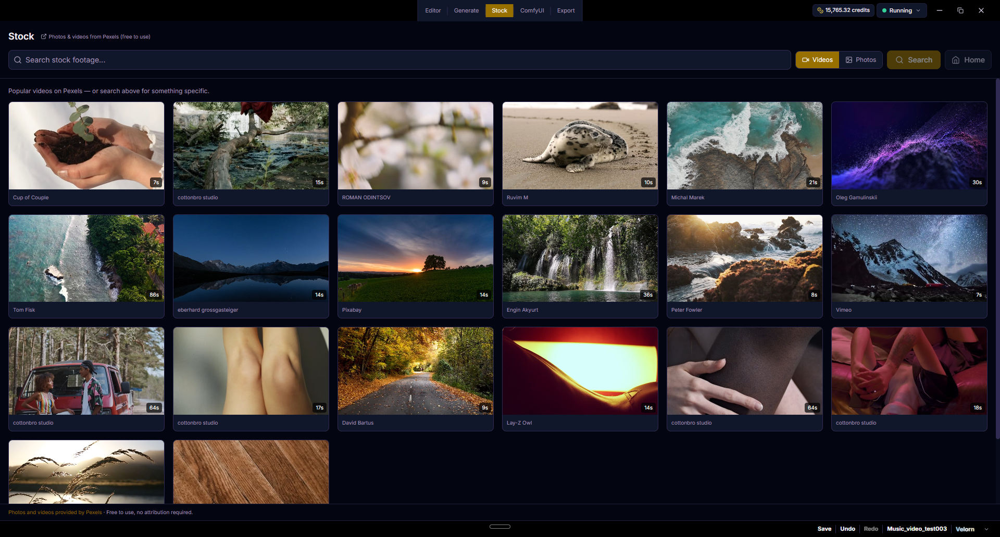
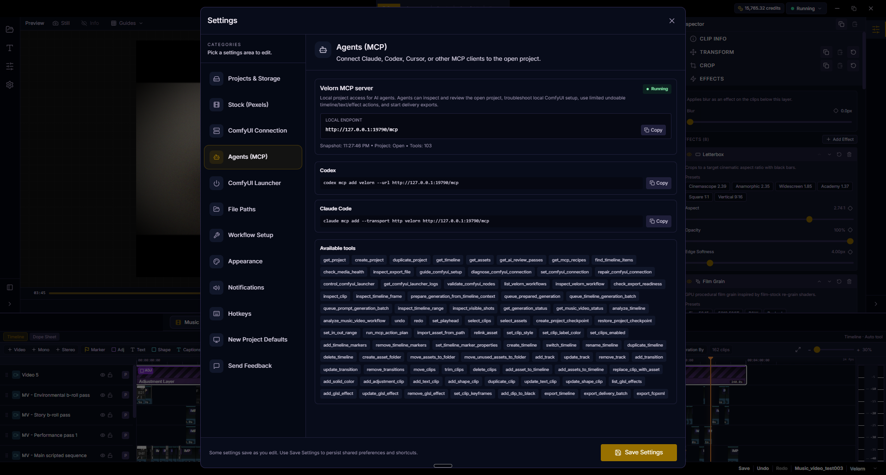
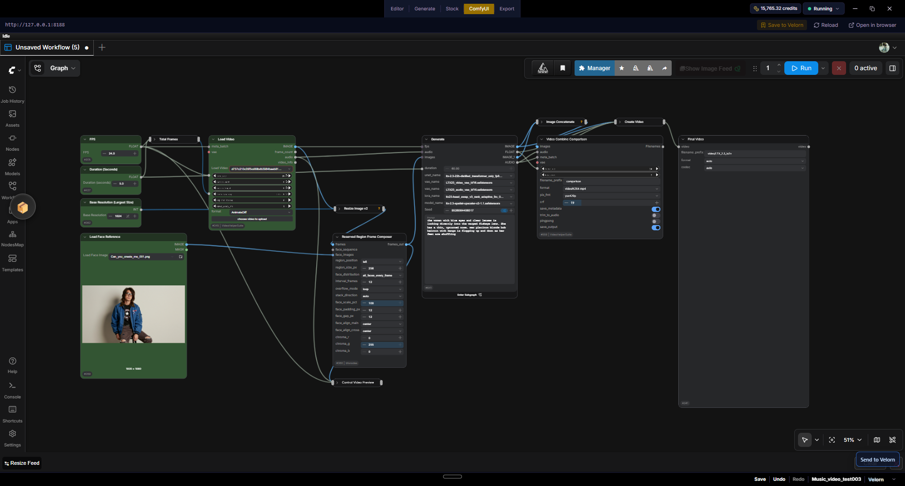
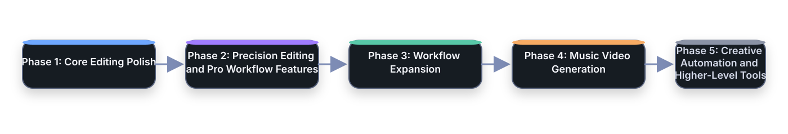

<div align="center">

# Belrog

**The open-source AI video workstation — a real editor for you, and 100+ MCP tools for your agent.**

[](https://github.com/BelrogLabs/belrog/releases/latest)
[](LICENSE)
[](https://github.com/BelrogLabs/belrog/releases/latest)

[](https://belrog.ai)
[](https://x.com/getbelrog)
[](https://discord.gg/QWZUuUChVK)

[](https://github.com/BelrogLabs/belrog/releases/latest)
[](https://github.com/BelrogLabs/belrog/releases/latest)
[](https://github.com/BelrogLabs/belrog/releases/latest)

English · [Español](docs/i18n/README.es.md) · [简体中文](docs/i18n/README.zh-CN.md) · [日本語](docs/i18n/README.ja.md) · [한국어](docs/i18n/README.ko.md) · [Português (Brasil)](docs/i18n/README.pt-BR.md) · [Français](docs/i18n/README.fr.md)

[Help translate the Belrog interface](docs/LOCALIZATION.md)

</div>

<p align="center"></p>
<p align="center"><i>One prompt. The agent generates media, builds the timeline, and mixes the audio — live, via MCP.</i></p>

Belrog is an open-source desktop video editor and AI video workstation. It brings planning, generation, asset management, timeline editing, captions, effects, and export into one project-based app.

Editing, captions, export, project management, and MCP editorial tools work without ComfyUI. All current generation features require a locally running ComfyUI instance.

Use built-in local and cloud workflows, bring your own ComfyUI API workflow JSON, or install the bundled Belrog Bridge so a graph open in ComfyUI can be sent back into Belrog.

<p align="center">
  
</p>

## What Belrog Is For

- Creating music videos from lyrics, timing, characters, keyframes, video shots, and timeline edits.
- Building UGC-style creator ads and small-business ads with editable shot plans.
- Running curated local and cloud image/video workflows from one Generate workspace.
- Running custom ComfyUI image, video, keyframe, and music-video workflows inside the app.
- Editing generated clips with tracks, transitions, effects, captions, proxy/cache tools, and export.
- Keeping generated media, prompts, workflow outputs, and timelines organized inside a project.

For generation, Belrog is not a replacement for ComfyUI. It is the production layer around ComfyUI: plan the work, send jobs to ComfyUI, collect the outputs, and finish the edit.

<p align="center">

</p>

## Download

Most users should download the packaged desktop app from the [GitHub Releases page](https://github.com/BelrogLabs/belrog/releases).

Release assets include:

- `Windows Installer`
- `Windows Portable`
- `Mac (Apple Silicon)`
- `Mac (Intel)`
- `Linux AppImage`
- `Linux deb`

Ignore GitHub's auto-generated source-code archives unless you plan to build Belrog from source.

## Main Features

### Generate

Generate runs built-in local workflows, cloud/partner workflows, and custom ComfyUI workflows.

- Local image, video, image-edit, audio, and utility workflows.
- Cloud workflows such as Nano Banana 2, GPT Image 2, Seedance, Kling, and other partner-node routes where available.
- Custom Image and Custom Video workflows for users who want Belrog to run their own ComfyUI API graphs.
- API JSON import for advanced users who prefer exporting workflows manually from ComfyUI.
- Belrog Bridge support so compatible graphs can be sent from ComfyUI back to the correct Belrog panel.
- Workflow setup checks for missing nodes, models, credentials, and configuration.
- A Featured / My Workflows / Templates browser with Local and Cloud filters. Imported community workflows appear in Featured next to the built-ins.

<p align="center">

</p>

The Templates tab browses the official ComfyUI template catalog (500+ templates with size and popularity info) and launches any of them into the embedded ComfyUI tab.

<p align="center">

</p>

### Create

Create contains guided creator workflows built on Belrog's Director Mode engine.

- **Music Video Creation** - turns a song, lyric timing, characters, references, and a director script into keyframes, video shots, and an editable timeline.
- **UGC Creator** - builds creator-style social ads with hooks, dialogue, product demos, try-ons, testimonials, and editable shot-by-shot outputs.
- **Business Ad Creator** - builds offer-first ads for local businesses, ecommerce products, events, services, and small teams.
- **Short Film Creation** - experimental script-to-scene coverage workflow. This is still very beta and may have rough edges.

### Music Video Creation

The Music Video Creator supports:

- Song import and lyric timing.
- ASR transcription or pasted-lyrics alignment into SRT.
- People/cast setup, including existing character sheets.
- Per-shot keyframe prompts, reference images, prompt copy, prompt editing, image replacement, and shot reruns.
- Built-in keyframe routes such as Qwen Image Edit and Nano Banana 2.
- Custom keyframe workflows using Belrog endpoint nodes.
- Built-in video routes such as LTX 2.3 Music and WAN 2.2.
- Custom video workflows with optional injected keyframe image, prompt, seed, width, height, FPS, duration, and audio.
- Timeline assembly from generated shot assets.

### Timeline Editor

The editor includes:

- Project asset browser.
- Multi-track video/audio timeline.
- Clip trimming, moving, snapping, overlap replacement behavior, and transitions.
- Text, shape, title, solid-color, adjustment-layer, keyframe, and visual effect tools.
- Inspector controls.
- Proxy/cache tools for smoother playback.
- Export panel for final renders.

### Captions

Captions can be generated from edited timeline audio and styled in-app.

- Timeline-aware transcription.
- Caption style presets.
- Font, color, outline, background, shadow, and animation controls.
- Saved caption style presets for reuse.
- Live preview with play/scrub controls and safe-zone overlays.
- Export-ready caption renders.

### Export

The Export tab includes practical render presets, hardware-accelerated options where available, numbered PNG image sequence export, queue controls, and project-aware output settings.

<p align="center">
  
</p>

### Stock

The Stock tab uses Pexels so you can search and import photos or videos directly into the current project. A Pexels API key is optional and can be added in Settings.

<p align="center">
  
</p>

### ComfyUI Integration

Belrog talks to a local ComfyUI server and can also help launch it.

- Default endpoint: `http://127.0.0.1:8188`
- Custom port support in Settings.
- Windows launcher support for a configured ComfyUI start script.
- macOS launcher support for a configured `ComfyUI.app`.
- Optional auto-start, stop-on-quit, and restart behavior.
- Embedded ComfyUI tab for opening and editing graphs.
- ComfyUI account login support inside the embedded ComfyUI tab.
- ComfyUI credit balance display when available.

Only localhost/loopback ComfyUI endpoints are supported in the desktop app.

### AI Agents (MCP)

Belrog includes a local MCP server with 100+ tools for Codex, Claude Code, Cursor-compatible tools, and other MCP clients.

- Endpoint: `http://127.0.0.1:19790/mcp`
- In-app setup: `Settings > Agents (MCP)` (one copy-paste command per client)
- Guide: [docs/MCP.md](docs/MCP.md)

Agents can inspect the open project, review timeline frames and visible shots, troubleshoot ComfyUI setup, preview safe timeline edits, queue approved generation work, and start delivery exports.

Agents can also bring in community ComfyUI workflows: hand one a workflow link or file, and it analyzes the graph, reports missing custom nodes and models, installs them after your approval, and runs the workflow on your timeline assets.

Most MCP write tools support a preview step, and many default to preview-first behavior. Normal timeline edits participate in Belrog's undo system. Imports, exports, generated files, project creation, and other filesystem changes are not universally undoable, so agents should get explicit approval before applying them. MCP is the recommended automation path for agent-assisted review, timeline operations, graphics polish, and generation workflows.

<p align="center">

</p>

## Custom Workflows

Custom workflows are one of the main reasons Belrog exists.

Advanced users can:

1. Open a starter graph from Belrog.
2. Modify it in ComfyUI.
3. Keep the required Belrog endpoint nodes.
4. Send it back with the Belrog Bridge or import the API workflow JSON manually.
5. Run that graph from Belrog as part of a creator flow or from Generate.

Common Belrog endpoint node titles include:

- Belrog input image - `BELROG_INPUT_IMAGE`
- Belrog prompt - `BELROG_PROMPT`
- Belrog seed - `BELROG_SEED`
- Belrog width - `BELROG_WIDTH`
- Belrog height - `BELROG_HEIGHT`
- Belrog FPS - `BELROG_FPS`
- Belrog duration - `BELROG_DURATION`
- Belrog audio - `BELROG_AUDIO`
- Belrog output image - `BELROG_OUTPUT_IMAGE`
- Belrog output video - `BELROG_OUTPUT_VIDEO`

Exact `BELROG_*` titles are preferred, but Belrog also recognizes readable titles such as `Belrog input image`. Older graphs that still use `COMFYSTUDIO_*` marker titles are supported for backward compatibility.

If an endpoint is present, Belrog can inject that value. If an endpoint is not present, the graph controls that setting itself.

<p align="center">
  
</p>

## Requirements

Normal editing:

- No ComfyUI installation or Comfy account is required.
- Allow enough disk space for project assets, cache files, and exports.

Generation:

- A separately installed local ComfyUI running on the same machine is required for all current generation workflows.
- Local workflows may require compatible hardware, models, and custom nodes.
- Partner-node workflows require the appropriate Comfy.org credentials and credits.

Optional integrations:

- Pexels API key for the Stock tab.
- LM Studio for the local LLM Assistant.

Local workflow requirements vary by model. Some workflows can run on modest GPUs, while heavy video workflows may need 24 GB+ VRAM. Cloud workflows shift most of that requirement to the provider but may require credits.

## First Run

1. Install and launch Belrog.
2. Choose a projects folder.
3. Create or open a project.
4. Use `Belrog > Getting Started` from the bottom menu if you want the guided setup path.

To use generation, configure your local ComfyUI instance in `Settings > ComfyUI Connection`. This step is optional for editing, captions, export, project management, and MCP editorial tools. If ComfyUI is running on a non-default port, update the endpoint in Settings and run the connection test.

## ComfyUI Setup Notes

Belrog ships workflow JSON files, but workflows still need the correct ComfyUI environment.

Depending on the workflow, users may need:

- Custom nodes installed in ComfyUI.
- Model files in the expected folders.
- Cloud/partner credentials.
- Enough local VRAM for the selected model and resolution.

Belrog 0.2.1+ talks to local ComfyUI without any CORS setup. On older Belrog versions, launch ComfyUI with `--enable-cors-header` if the embedded tab is blank or API calls return 403.

Inside Generate, use the workflow setup and dependency tools when something is missing.

## Run From Source

For development, run the Electron app:

```bash
npm install
npm run electron:dev
```

Browser-only `npm run dev` is useful for frontend work, but Electron is the normal development path because many features depend on desktop APIs.

## Build Commands

```bash
npm run build
npm run electron:build:win
npm run electron:build:mac
npm run electron:build:linux
```

Packaged artifacts are written to `release/`.

For release process details, see:

- `docs/RELEASE_PROCESS.md`
- `docs/CI_SECRETS.md`
- `docs/AI_RELEASE_HANDOFF.md`

## Roadmap

See [ROADMAP.md](ROADMAP.md).

<p align="center">
  <a href="ROADMAP.md">
    
  </a>
</p>

## Contributing

Belrog is open source, and contributions are welcome.

See:

- `CONTRIBUTING.md`
- `CODE_OF_CONDUCT.md`
- `SECURITY.md`

## License

Belrog is licensed under the GNU General Public License v3.0. See `LICENSE`.

Versions released before this license change remain available under the license terms they were released with.
